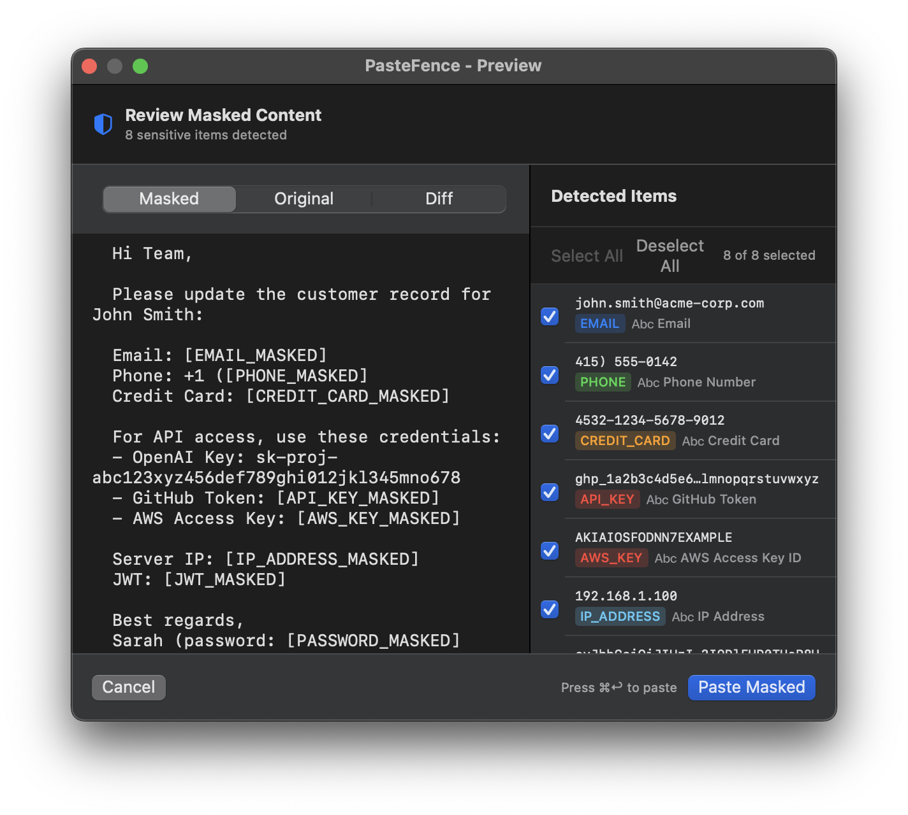
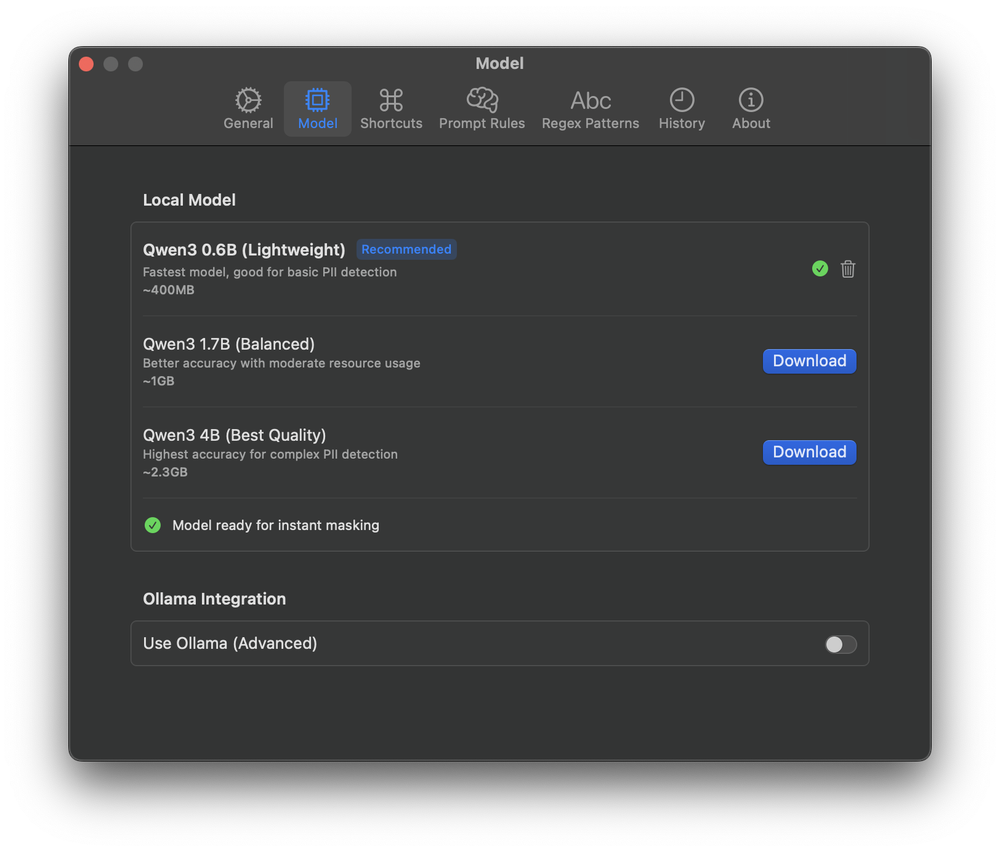

<div align="center">



# PasteFence

**Mask sensitive information before pasting. All processing stays on your Mac.**

[](https://github.com/choru-k/PasteFence/releases)
[](https://github.com/choru-k/PasteFence)
[](LICENSE)
[](https://github.com/choru-k/PasteFence)

[**Install**](#installation) · [**Usage**](#usage) · [**Screenshots**](#screenshots) · [**Build**](#build-from-source)

</div>

---

## Quick Install

```bash
brew tap choru-k/pastefence
brew install --cask pastefence
```

Or download directly from [GitHub Releases](https://github.com/choru-k/PasteFence/releases).

---

## Why PasteFence?

We copy and paste everything into AI tools like ChatGPT every day. But sometimes we accidentally leak sensitive data — API keys, passwords, personal info — straight onto the public internet.

Manually checking every paste is tedious. Finding and removing each sensitive item is even harder.

**PasteFence catches it for you, before it leaves your Mac.**

---

## How It Works

<div align="center">

[](https://choru-k.github.io/PasteFence/)

**[▶️ Watch Demo](https://choru-k.github.io/PasteFence/)**

</div>

| Step | Action | Description |
|:---:|:---|:---|
| **1** | Copy text normally | `Cmd + C` |
| **2** | Trigger masking | `Cmd + Shift + V` |
| **3** | Review detected PII | Preview window shows what will be masked |
| **4** | Approve & paste | Masked text goes to clipboard and pastes |

---

## Features

<table>
<tr>
<td width="50%">

### 🔒 100% Local Processing
All detection happens on-device using MLX-Swift. Your sensitive data never leaves your Mac.

</td>
<td width="50%">

### ⚡ Hybrid Detection
Fast regex catches common patterns (~1ms), while local LLM handles context-aware detection.

</td>
</tr>
<tr>
<td width="50%">

### 👁️ Preview Before Paste
Review exactly what will be masked. Toggle individual items on/off before approving.

</td>
<td width="50%">

### 🎨 Customizable
Choose masking formats, configure hotkeys, and adjust detection sensitivity.

</td>
</tr>
</table>

---

## What It Detects

**Built-in patterns** (toggle on/off individually):

| Category | Types |
|----------|-------|
| **Personal** | Email, phone numbers, SSN, passport, healthcare IDs |
| **Financial** | Credit card numbers |
| **Technical** | API keys (OpenAI, GitHub, AWS, Slack), JWT tokens, IP addresses, passwords, private keys |

**Plus:**
- **Custom Rules**: Add your own detection patterns
- **LLM Filtering**: Describe what to detect with a prompt — the local LLM handles the rest

---

## Screenshots

<div align="center">

| Preview Window | Settings |
|:---:|:---:|
|  |  |

</div>

---

## Installation

### Homebrew (Recommended)

```bash
brew tap choru-k/pastefence
brew install --cask pastefence
```

### Direct Download

1. Download the latest `.dmg` from [GitHub Releases](https://github.com/choru-k/PasteFence/releases)
2. Open the DMG and drag to Applications
3. Launch PasteFence from Applications

The app is signed and notarized by Apple - no Gatekeeper warnings.

---

## Usage

1. **Copy text** normally with `Cmd+C`
2. **Trigger masking** with `Cmd+Shift+V`
3. **Review** the masked result in the preview window
4. **Approve** with "Paste Masked" button or `Cmd+Enter`

The masked text is automatically pasted to your active application.

---

## Requirements

| Requirement | Details |
|:---|:---|
| **macOS** | 14.0+ (Sonoma or later) |
| **Chip** | Apple Silicon (M1/M2/M3/M4) recommended |
| **RAM** | 8GB minimum |
| **Permissions** | Accessibility (for global hotkeys) |

---

## Configuration

### Local Model (Default)

On first launch, go to **Settings → Model** to download the default model (Qwen3-0.6B, ~400MB).

Models are stored in: `~/Library/Application Support/PasteFence/models/`

### Ollama Integration (Optional)

For advanced users who prefer Ollama:

1. Install [Ollama](https://ollama.ai)
2. Run `ollama serve`
3. Enable "Use Ollama" in **Settings → Model**

---

## Build from Source

```bash
# Clone
git clone https://github.com/choru-k/PasteFence.git
cd PasteFence

# Resolve dependencies
swift package resolve

# Build release
swift build -c release

# Run
.build/release/PasteFence
```

> **Note**: The KeyboardShortcuts library uses Swift macros that require Xcode for proper compilation. Open `Package.swift` in Xcode for full build support.

---

## Tech Stack

- **Language**: Swift 5.9+
- **UI**: SwiftUI + AppKit
- **LLM Runtime**: MLX-Swift (Apple Silicon optimized)
- **Default Model**: Qwen3-0.6B-MLX-8bit

## Architecture

```
AppCoordinator (orchestrator)
    ├── ClipboardService      # NSPasteboard read/write
    ├── HotkeyService         # Global Cmd+Shift+V via KeyboardShortcuts
    └── MaskingEngine         # Combines detection results
            ├── RegexDetector     # Fast pattern matching
            └── LLMDetector       # Contextual detection via MLX
```

---

## License

GPL-3.0 License - see [LICENSE](LICENSE) for details.

---

<div align="center">

**Made with ❤️ for privacy-conscious Mac users**

</div>
